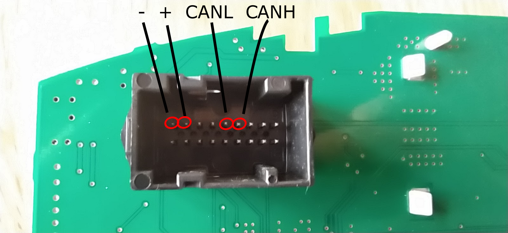
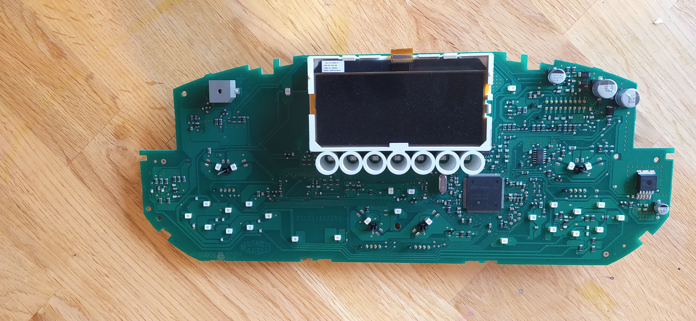
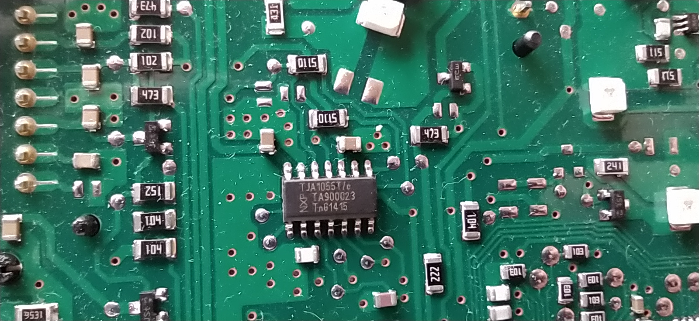

# Ducato can speedmeter
The goal of these project is to build a can device thats translate the speed signal +15%. A second goal is to switch on the camera during driving and prevent the sleep mode after 20 minutes of the infotainment system

# Hardware
We use the SammyC21 Board from chip45.com. https://www.chip45.com/products/sammy-c21-1.0_atmel_smart_arm_sam_module_board_samc21_usb_dual_two_can.php?de
Order the board with a pre installed chip45bootSAM Bootloader. It´s super easy to flash the board with this bootloader via USB (windows only ;( )

## Instrument cluster / Kombinstrument pins






### sidenotes for people who run into the same issues like me: 
#### Set the SAMC21 to 500kbit/s
it seems the calculation for the BTP register is wrong in the m_can driver for the SAMC21. We need to set the BTB register manually and do not use the caluclation from atmel. You can calculate the rate here if you need other than 500kbit/s: http://www.bittiming.can-wiki.info/#M_CAN

Set inside the config/hpl_can_config.h:
```
#define CONF_CAN0_BTP_REG 0x00010c10
#define CONF_CAN0_DBTP_REG 0x00010c10
```
instead of 
```
#define CONF_CAN0_BTP_BRP 2
#define CONF_CAN0_BTP_TSEG1 13
#define CONF_CAN0_BTP_TSEG2 2
#define CONF_CAN0_BTP_SJW 1

#define CONF_CAN0_DBTP_DBRP 2
#define CONF_CAN0_DBTP_DTSEG1 13
#define CONF_CAN0_DBTP_DTSEG2 2
#define CONF_CAN0_DBTP_DSJW 1
```
